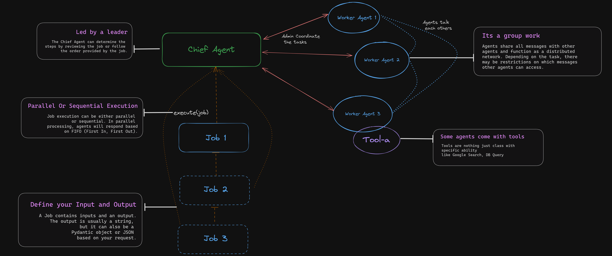

# Ceylon: A Multi-Agent System (MAS)

> Empowering Collaboration, Simplifying Complexity

[](https://pypi.org/project/ceylon)
[](https://pypi.org/project/ceylon)

## Introduction

Welcome to Ceylon: A Multi-Agent System (MAS) designed to orchestrate complex task flows among multiple AI agents. Ceylon manages and automates interactions between agents, each with specific roles and responsibilities, enabling powerful collaborative AI solutions. By empowering collaboration and simplifying complexity, Ceylon opens up new possibilities in AI-driven task automation and problem-solving.



## 🚀 Key Features

- **Agent Management**: Easily define and manage agents with specific roles and tools.
- **Task Automation**: Automate task flow based on agent input and predefined sequences.
- **Scalability**: Handle multiple agents and complex workflows with ease.
- **Customization**: Highly adaptable to fit diverse use cases.
- **Distributed Architecture**: Developed as a robust distributed system.
- **Efficient Message Propagation**: Utilizes a powerful framework for reliable inter-agent communication.
- **Interoperability and Performance**: Ensures seamless operation across different programming languages while providing memory safety and high performance.
- **Chief Agent Leadership**: Centralized task management and execution flow.
- **Parallel or Sequential Execution**: Adapt to your task's needs.
- **Customizable I/O**: Define inputs and outputs tailored to your requirements.
- **Versatile Deployment**: Run as a server or standalone application.

## 🌟 Why Ceylon?

Ceylon pushes the boundaries of what's possible in task automation and AI collaboration. It's not just another framework; it's a new paradigm for solving complex problems.

- **Achieve the Impossible**: Tackle tasks that traditional single-agent or monolithic systems can't handle.
- **Flexible Architecture**: Easily adapt to various use cases, from customer support to market analysis.
- **Scalable Performance**: Distribute workload across multiple agents for improved efficiency.
- **Rich Interaction**: Agents share information, creating a truly collaborative AI ecosystem.

## 🛠️ Use Cases

- Automated customer support systems
- Intelligent meeting schedulers
- Real-time stock market analysis
- AI-driven content creation pipelines
- Complex data processing and decision-making systems

## 🚦 Getting Started

Here's a simple example of how to use Ceylon to create a multi-agent system for a trading decision process:

```python
from ceylon import Agent, AgentJobStepRequest, AgentJobResponse, JobRequest, JobSteps, Step, RunnerAgent

class TechnicalAnalysisAgent(Agent):
    async def execute_request(self, request: AgentJobStepRequest) -> AgentJobResponse:
        return AgentJobResponse(
            worker=self.details().name,
            job_data={"MA": 100.0, "EMA": 200.0}
        )

class NewsSentimentAgent(Agent):
    async def execute_request(self, request: AgentJobStepRequest) -> AgentJobResponse:
        return AgentJobResponse(
            worker=self.details().name,
            job_data={"sentiment": "Positive"}
        )

class DecisionMakerAgent(Agent):
    async def execute_request(self, request: AgentJobStepRequest) -> AgentJobResponse:
        return AgentJobResponse(
            worker=self.details().name,
            job_data={"trade": True}
        )

# Create agent instances
ta_agent = TechnicalAnalysisAgent(name="ta", role="Technical Analyst")
news_agent = NewsSentimentAgent(name="news", role="News Analyst")
decision_agent = DecisionMakerAgent(name="decision", role="Decision Maker")

# Create the runner agent
chief = RunnerAgent(workers=[ta_agent, news_agent, decision_agent])

# Define the job
job = JobRequest(
    title="Trading Decision",
    explanation="Analyze market data and make a trading decision",
    steps=JobSteps(steps=[
        Step(worker="ta", explanation="Perform technical analysis", dependencies=[]),
        Step(worker="news", explanation="Analyze news sentiment", dependencies=[]),
        Step(worker="decision", explanation="Make trading decision", dependencies=["ta", "news"])
    ])
)

# Execute the job
result = chief.execute(job)
print(result)
```

This example demonstrates how to:
1. Define custom agents for different tasks
2. Create a runner agent to orchestrate the process
3. Define a job with multiple steps and dependencies
4. Execute the job and get the result

## 🚧 Todo

- [X] LLM Agent Stack
- [x] Job Handling (parallel & sequential)
- [ ] Web Agent
- [ ] Agent Registry

## 🤝 Contributing

We welcome contributions! Please read our [contributing guidelines](CONTRIBUTING.md) before submitting a pull request.

## 📄 License

Ceylon is released under the MIT License. See the [LICENSE](LICENSE) file for details.

## 📞 Contact

For questions or support, please contact us at [support@ceylon.ai](mailto:support@ceylon.ai).

---

Built with ☕ by the Ceylon Team. Star us on GitHub if you find this interesting!